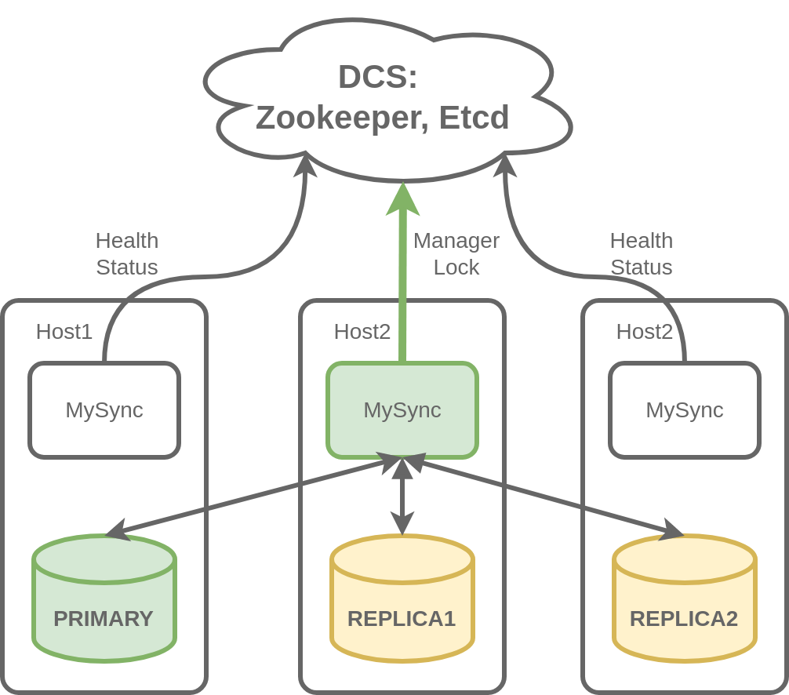

## MySync

MySync is mysql high-availability and cluster configuration tool.
MySync is designed to switch master in homogeneous MySQL cluster in manual and automatic mode without data loose.

#### Project status

MySync is production-ready, it is being used in large production setups. 
We appreciate any kind of feedback and contribution to the project.

### Architecture
    


### Limitations and requirements

* MySQL 5.7+ with GTID's enabled
* MySQL cluster is homogeneous - all nodes have exactly the same data
* ZooKeeper database to keep state and locks

### MySQL configuration

```
# required
gtid_mode = ON
enforce_gtid_consistency = ON
log_slave_updates = ON
binlog_format = ROW

# required, managed by mysync
read_only = ON
super_read_only = ON
offline_mode = ON

# recommended
sync_binlog = 1
innodb_flush_log_at_trx_commit = 1

```

### MySync configuration example

```
log: /var/log/mysync/mysync.log
loglevel: Debug

lockfile: /var/run/mysync/mysync.lock
emergefile: /var/run/mysync/mysync.emerge
resetupfile: /var/run/mysync/mysync.resetup

resetup_crashed_hosts: False
db_timeout: 2s
db_lost_check_timeout: 5s
tick_interval: 5s
healthcheck_interval: 5s
info_file_handler_interval: 5s
dcs_wait_timeout: 30s
critical_disk_usage: 95.00
not_critical_disk_usage: 94.76
disable_semi_sync_replication_on_maintenance: true
keep_super_writable_on_critical_disk_usage: true
db_set_ro_timeout: 30s
db_set_ro_force_timeout: 60s
priority_choice_max_lag: 60s
offline_mode_enable_interval: 900s
offline_mode_enable_lag: 86400s
offline_mode_disable_lag: 300s
disable_set_readonly_on_lost: False
exclude_users:
    - 'repl'
    - 'admin'
    - 'monitor'
    - 'event_scheduler'

semi_sync: true
rpl_semi_sync_master_wait_for_slave_count: 1
semi_sync_enable_lag: 33554432

failover: true
failover_cooldown: 3600s
failover_delay: 60s
inactivation_delay: 120s

zookeeper:
  session_timeout: 10s
  namespace: /mysql/cluster_id_1
  hosts:
    - zk01.db.company.net:2181
    - zk02.db.company.net:2181
    - zk03.db.company.net:2181

mysql:
  user: admin
  password: **********
  ssl_ca: /etc/mysql/ssl/allCAs.pem
  replication_connect_retry: 10
  replication_retry_count: 0
  replication_heartbeat_period: 2
  replication_port: 3306
  replication_user: repl
  replication_password: ********
  replication_ssl_ca: /etc/mysql/ssl/allCAs.pem
  external_replication_ssl_ca: /etc/mysql/ssl/external_CA.pem
  port: 3306

stream_from_reasonable_lag: 5m
stream_from_max_catchup_wait: 5m

replication_repair_aggressive_mode: False
replication_repair_cooldown: 60s
replication_repair_max_attempts: 3

```

### Usage

```
mysync hosts add fqdn1.db.company.net
mysync hosts add fqdn2.db.company.net
mysync hosts add fqdn3.db.company.net

mysync info -s
mysync switch --to fqdn2
mysync switch --from fqdn2
mysync maint on
mysync maint off
```


